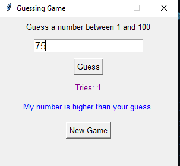

#About This Project 

# Importing necessary libraries
import random
import tkinter as tk

# --- Main variables for the game ---
number_to_guess = 0
tries_count = 0

def start_new_game():
    global number_to_guess, tries_count # Declaring intent to modify global variables 
    number_to_guess = random.randint(1, 100) # Selects a new random number
    tries_count = 0 # Resets the try counter

    # Resetting the window's elements to their initial state
    instruction_label.config(text="Guess a number between 1 and 100") 
    result_label.config(text="") # Clears the result message
    attempts_label.config(text="Tries: 0") # Resets the displayed tries to 0
    
    guess_input_box.delete(0, tk.END) # Clears any number in the guess input box
    guess_button.config(state=tk.NORMAL) # Enables the guess button
    guess_input_box.config(state=tk.NORMAL) # Enables the guess input box
    guess_input_box.focus_set() # Sets focus for easier typing

# Function to check the user's guess
def check_guess():
    global tries_count
    
    try:
        user_guess = int(guess_input_box.get()) # Converts the user's input to an integer
        
        # Checks if the user's number is outside the allowed range
        if user_guess < 1 or user_guess > 100:
            result_label.config(text="Please enter a number between 1 and 100.") 
            return 
        
        # If the number is valid, increments the try counter
        tries_count += 1 
        attempts_label.config(text=f"Tries: {tries_count}") # Updates the displayed number of tries
        
        if user_guess > number_to_guess:
            result_label.config(text="My number is lower than your guess.")
        elif user_guess < number_to_guess:
            result_label.config(text="My number is higher than your guess.")
        else: 
            result_label.config(text=f"Congrats! The number was {number_to_guess}!")
            guess_button.config(state=tk.DISABLED) # Disables the button and input box
            guess_input_box.config(state=tk.DISABLED)
# Handles non-numeric input errors           
    except ValueError:
        result_label.config(text="Please enter only numbers.")
        
    guess_input_box.delete(0, tk.END) # Clears the input box after each guess

# --- Main Window Setup ---
main_window = tk.Tk() # Creates the main window
main_window.title("Guessing Game") # Sets the window title
main_window.geometry("300x250") 
main_window.resizable(False, False) # Prevents the user from resizing the window

# --- Widgets (elements inside the window) ---

# Instruction Label
instruction_label = tk.Label(main_window, text="Guess a number between 1 and 100:", font=("Arial", 10))
instruction_label.pack(pady=5) 

# Input box for user's guess
guess_input_box = tk.Entry(main_window, width=20, font=("Arial", 12))
guess_input_box.pack(pady=5)
guess_input_box.focus_set()
guess_input_box.bind("<Return>", lambda event: check_guess()) # Checks guess when Enter is pressed

# Guess Button
guess_button = tk.Button(main_window, text="Guess", command=check_guess, font=("Arial", 10))
guess_button.pack(pady=5)

# Attempts Label
attempts_label = tk.Label(main_window, text="Tries: 0", font=("Arial", 10), fg="purple")
attempts_label.pack(pady=5)

# Result Label
result_label = tk.Label(main_window, text="", font=("Arial", 10), fg="blue")
result_label.pack(pady=5)

# Button for new game 
new_game_button = tk.Button(main_window, text="New Game", command=start_new_game, font=("Arial", 10))
new_game_button.pack(pady=10)

# --- Start the game ---
start_new_game()

# --- Keep window open ---
main_window.mainloop()
